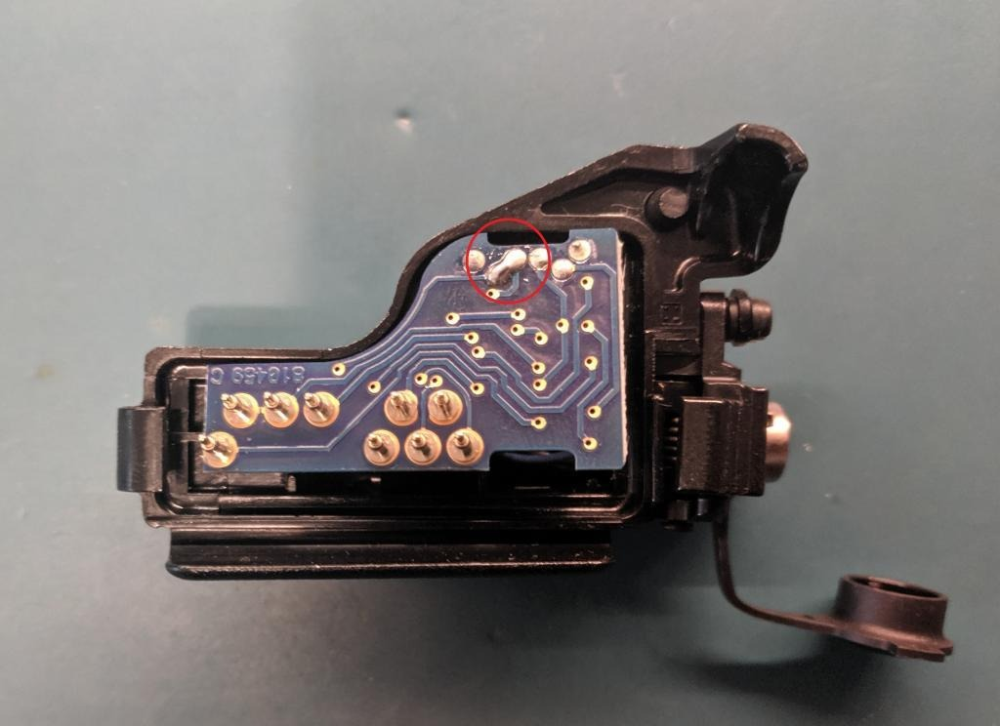

# XTS Hirose adapter modification
A Motorola NTN8613C Hirose adapter for XTS can be modified to be used on both Motorola and EF Johnson radios. However, there are some caveats:

1. Audio accessories will continuously transmit when used with the adapter (OPT_SEL1 is pulled low by the audio accessory but OPT_SEL2 is tied low all the time)
2. This may trigger the man down function as OPT_SEL2 is tied low all the time even when CTS is not pulled low (CTS low = keyload mode for Motorola, pulled low by KVL/KFDtool)
3. For EFJ radios, you need to connect the adapter to the Hirose cable and the KVL/KFDtool first, then connect to the radio. If you connect the adapter to the radio first and then connect the Hirose cable it will not work. This is because multiple pins need to be asserted simultaneously for the EFJ radio to go into keyload mode.

To complete the modification, use a soldering iron to bridge the two contacts shown in the image below:

